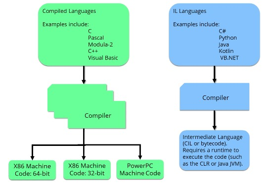

Section 1 : Introduction and Course Information
===


## Information
- Title:  `Introduction and Course Information`
- Authors:  `Etienne KOA`

## explique ce qui se passe sous le capot

1. Comment fonctionne l'ordinateur ?

2. Binaire

3. Code machine

4. Langage d'assemblage et plus encore.

## Qu'est-ce que le C# ?

+ Un langage compilé crée un code machine natif pour le matériel informatique sur lequel il sera exécuté.

+ Le compilateur prend le code source du programme et l'utilise pour créer du code machine.

+ Si vous souhaitez que le programme s'exécute sur un matériel différent, le programme doit être recompilé à l'aide d'un compilateur qui produit du code machine pour le nouveau matériel.

+ Un langage interprété est généralement compilé en un langage intermédiaire.

+ Dans le cas de `C#`, cela s'appelle `CIL`.

+ Vous connaissez peut-être la « JVM » de Java, que vous avez peut-être dû installer pour exécuter certains programmes Java sur votre ordinateur - ou dans votre navigateur.

+ Afin d'exécuter le bytecode sur un ordinateur, un programme doit être en cours d'exécution pour interpréter le bytecode au moment de l'exécution.

+ Pour exécuter votre programme `C#`, vous devrez avoir installé le `CLR`, ou `Common Language Runtime`.

+ Le `CLR` est inclus avec le framework `.NET` de Microsoft.

+ Bien qu'à l'origine elle n'était disponible que pour Windows, Microsoft a créé une version open source qui fonctionnera sur les ordinateurs « Linux » et « Mac », ainsi que sur « Android » et « IOS ».

+ Le runtime `.NET` - le `CLR` - fait désormais partie intégrante du système d'exploitation `Windows`. Cela signifie que vos programmes « C# » s'exécuteront sur n'importe quel ordinateur Windows moderne.

+ Cependant, le `.NET SDK (Software Development Kit)` ne sera probablement pas installé.

+ Cela signifie que pour le développement, nous devons toujours télécharger et installer le `SDK`, même sous Windows.

+ Le `SDK` est nécessaire pour compiler votre code `C#`.

+ Le `.NET Runtime` sera nécessaire sur tout ordinateur sur lequel vous souhaitez exécuter votre programme.

+ Il inclut les systèmes Windows modernes, mais devra être installé sur les ordinateurs « Mac » et « Linux » sur lesquels le « SDK » n'est pas installé.



## Getting the Software Tools

+ Install `.NET SDK`, and integrated Development Environment (IDE)
+ `Windows/Mac` - Visual Studio Community Edition.
+ `Linux` - Visual Studio Code.


## Install Visual Studio on Windows

[Visual Studio Community Edition](https://visualstudio.microsoft.com/fr/)

## Install Visual Studio on Windows

[Visual Studio Community Edition](https://visualstudio.microsoft.com/fr/)

## Linux - Setup `.NET` framework `SDK` and Visual Studio Code

[.NET Downloads](https://dotnet.microsoft.com/en-us/download)

[Visuak Studio Website](https://code.visualstudio.com/)


+ Quelques Commandes 

```
dotnet new --help

Bienvenue dans .NET 8.0 !
---------------------
Version du kit SDK : 8.0.200

Télémétrie
---------
Les outils .NET collectent des données d'utilisation qui nous aident à améliorer votre expérience utilisateur. Elles sont collectées par Microsoft et partagées par la communauté. Vous pouvez refuser l'adhésion à la télémétrie en affectant la valeur '1' ou 'true' à la variable d'environnement DOTNET_CLI_TELEMETRY_OPTOUT via l'interpréteur de commandes de votre choix.

Pour plus d'informations sur la télémétrie des outils CLI .NET, accédez à https://aka.ms/dotnet-cli-telemetry   

----------------
Installation d'un certificat de développement HTTPS ASP.NET Core.
Pour faire confiance au certificat, exécutez 'dotnet dev-certs https --trust'
En savoir plus sur HTTPS : https://aka.ms/dotnet-https

----------------
écrivez votre première application : https://aka.ms/dotnet-hello-world
Découvrez les nouveautés : https://aka.ms/dotnet-whats-new
Explorez la documentation : https://aka.ms/dotnet-docs
signaler les problèmes et trouver une source sur GitHub : https://github.com/dotnet/core
Utilisez « dotnet --help » pour afficher les commandes disponibles ou visitez : https://aka.ms/dotnet-cli       
--------------------------------------------------------------------------------------
Description:
  Commandes d'instanciation de modèle pour .NET CLI

Utilisation :
  dotnet new [<template-short-name> [<template-args>...]] [options]
  dotnet new [command] [options]

Arguments :
  <template-short-name>  Nom court du modèle à créer
  <template-args>        Options spécifiques au modèle à utiliser

Options :
  -o, --output <output>    Emplacement pour la sortie générée.
  -n, --name <name>        Le nom de la sortie est en cours de création. Si aucun nom n’est spécifié, le nom du 
                           répertoire de sortie est utilisé.
  --dry-run                Affiche un résumé de ce qui se passerait si la ligne de commande donnée était        
                           exécutée si cela aboutissait à la création d’un modèle.
  --force                  Force la création du contenu même si cela modifie des fichiers existants.
  --no-update-check        Désactive la vérification des mises à jour du package de modèles lors de
                           l’instanciation d’un modèle.
  --project <project>      Projet à utiliser pour l’évaluation du contexte
  -v, --verbosity <LEVEL>  Définit le niveau de détail. Les valeurs autorisées sont q[uiet], m[inimal],
                           n[ormal] et diag[nostic]. [default: normal]
  -d, --diagnostics        Active la sortie des diagnostics.
  -?, -h, --help           Affichez l'aide de la ligne de commande.

Commandes :
  create <template-short-name> <template-args>  Instancie un modèle avec le nom court donné. Alias de « dotnet  
                                                new <template name> ».
  install <package>                             Installe un package de modèle.
  uninstall <package>                           Désinstalle un package de modèle.
  update                                        Consulte les packages de modèles actuellement installés pour la 
                                                mise à jour et installez les mises à jour.
  search <template-name>                        Recherche les modèles sur NuGet.org.
  list <template-name>                          Répertorie les modèles contenant le nom de modèle spécifié. Si  
                                                aucun nom n’est spécifié, répertorie tous les modèles.
  details <package-identifier>                  Fournit les détails du package de modèle spécifié.
                                                      La commande vérifie si le package est installé
                                                localement, s'il n'a pas été trouvé, il recherche les flux      
                                                NuGet configurés.


/c/Csharp_For_Beginners_Crash_Course/Section1_Introduction_And_Course_Information/temp_test
$ dotnet new console
Le modèle « Application console » a bien été créé.

Traitement des actions postérieures à la création en cours... Merci de patienter.
Restauration de C:\Csharp_For_Beginners_Crash_Course\Section1_Introduction_And_Course_Information\temp_test\temp_test.csproj :
  Identification des projets à restaurer...
  Restauration effectuée de C:\Csharp_For_Beginners_Crash_Course\Section1_Introduction_And_Course_Information\t       
  emp_test\temp_test.csproj (en 109 ms).
Restauration réussie.


$ dotnet run
Hello, World!

/c/Csharp_For_Beginners_Crash_Course/Section1_Introduction_And_Course_Information/temp_test
$ dotnet run
Working fine on Ubuntu Linux 18.04
Hello, World!
```

## Quizz

**Question 1 :**

+ Lequel des énoncés suivants décrit une différence importante entre un langage interprété tel que C# et un langage compilé comme C ou C++ ?

  + `Un langage compilé` est compilé en code machine, `un langage interpreté` est compilé en bytecode.

    + Le bytecode `C#` est exécuté par le `CLR`, qui partie du `.NET Framework`.

**Question 2**
+ De quoi avez-vous besoin pour devélopper des programmes `C#` ?

  + Un ordinateur sur lequel le `SDK.NET` est inatllé et un `IDE` ou un éditeur de texte.

    + Le `SDK.NET` est nécessaire pour compiler votre `C#` et inclut le `CLR` pour exécuter le bytecode compilé.

**Question 3 :**

+ Parmi les propositions suivantes, laquelle est la syntaxe correcte pour appeler la méthode `ReadLine` de la classe Console ?

  ```
  input = System.Console.ReadLine();
  ```

  + Vous pouvez éviter de taper `System` à chaque fois en utilisant `System`; au début du programme.