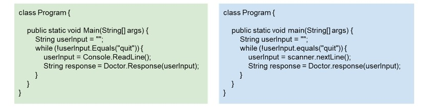
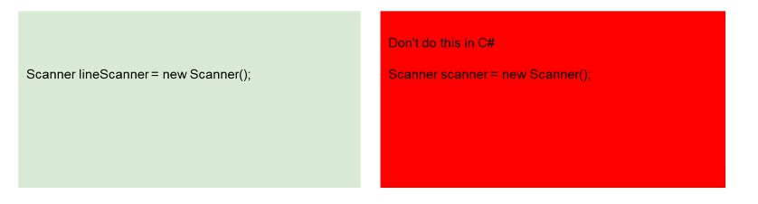
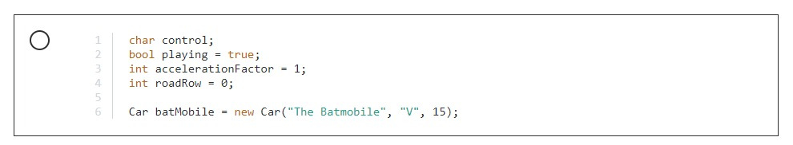

Section 2 : Starting to Code
===

## Information
- Title:  `Starting to Code`
- Authors:  `Etienne KOA`

## Naming Convention

[Naming Convention](https://learn.microsoft.com/en-us/dotnet/standard/design-guidelines/capitalization-conventions)

+ L'un de ces extraits de code est « Java » et l'autre est « C# ».
+ Pouvez-vous dire lequel est lequel ?
+ Je vais vous donner quelques secondes le code, et voir si vous pouvez faire la différence.
+ À l'exception d'une ligne, ce code fonctionnerait avec les deux langues. Cette ligne donnera une erreur, mais tout le reste fonctionnera bien.
+ Quelqu'un qui a programmé en `C#` ou `java` repérera très rapidement lequel est lequel, même si cette ligne a été supprimée. La raison pour laquelle ils feraient cela est à cause des conventions de codage différentes utilisées par les deux langues.
+ Je ne vais pas discuter des conventions `java`, mais je vais parcourir le code et décrire les conventions utilisées en `C#`. Une fois que j'aurai terminé, vous ne saurez plus lequel est le code « C# ».
+ En partant du haut, la convention en `C#` est que les noms de classes doivent commencer par une lettre majuscule. Le nom de la classe est « Program », il a donc une lettre majuscule.
+ La prochaine convention est celle sur laquelle « Microsoft » ne semble pas être d'accord.
+ Les IDE Visual Studio placent les accolades ouvrantes sur une nouvelle ligne. Les exemples de code, dans ce document « Directives de dénomination » que j'ai lié à tp, les mettent en fin de ligne - comme nous l'avons dans ces extraits.
+ L'un ou l'autre de ces échantillons pourrait donc être conforme à la convention de Microsoft pour l'ouverture des accolades. Vous trouverez de nombreux arguments en ligne à ce sujet.
+ Faites ce qui vous semble le plus confortable. Mais soyez prêt à vous intégrer aux autres programmeurs de votre entreprise, s'ils le font différemment.
+ OK, la prochaine convention commence pour dévoiler le jeu.
+ La convention `C#` consiste à commencer les noms de méthodes par un vcapital et à utiliser la casse Pascal si le nom contient plus d'un mot.
+ En fait, si un nom commence par une majuscule, alors vous utiliserez « Pascal » - tous les mots composant le nom commenceront également par une majuscule. Cela permet de se rappeler facilement quand utiliser le cas « Pascal ».
+ Le nom de notre méthode est `main`, vous pouvez donc maintenant savoir lequel de ces bits de code est `C#` et lequel est `Java`.
+ Ensuite, les noms de variables sont écrits dans `CamelCase`.
+ Le strat avec une lettre minuscule, mais tous les mots suivants commencent par une majuscule. Cela rend les noms plus lisibles, car cela sépare les mots, sans utiliser d'espace, ce qui n'est pas autorisé dans les noms.
+ Notre première variable s'appelle `userInput`, qui commence par un `u` minuscule et le `I` est en majuscule.

+ La variable suivante est `response`. Cela commence également par une lettre minuscule.

+ J'ai déjà mentionné que les noms de méthodes, en `C#`, commencent par une lettre majuscule.
+ La méthode `ReadLine` de la classe `Console` est écrite en utilisant la convention `C#`.
+ Côté commande, la méthode `nextLine` de `scanner` commence par un `n` minuscule - la convention java.
+ Notez qu'à gauche, `Console` est une classe. Sur le côté droit, « scanner » est un objet - une instance de la classe `Scanner` (avec un `S` majuscule).
+ La convention selon laquelle les noms de classe commencent par une majuscule et les variables par une lettre minuscule permet de repérer facilement que `Console` est une classe et `scanner` est une variable. Cette convention est valable pour les deux langues et rend le code plus facile à lire.
+ Ne vous inquiétez pas de ce que sont les méthodes `statiques`, nous les aborderons plus tard. Mais rien qu'en observant la majuscule, nous pouvons dire que `ReadLine` est une méthode statique, alors que `nextLine` est une méthode d'instance.
+ Comme je l'ai dit, cela n'a pas encore de sens. Mais cela montre comment la convention de dénomination peut être utile lors de la lecture du code.
+ En regardant cette ligne de droite, scanner avec une minuscule, est probablement une instance d'une classe appelée `Scanner`, avec un `S` majuscule.
+ C'est une façon courante de faire les choses dans d'autres « langages orientés objet ». Mais nous ne devrions pas faire cela en `C#`.
+ Bien que le code fonctionne souvent si vous le faites, la spécification du langage n'indique pas que les noms différant uniquement par leur casse seront considérés comme différents.

 

 

+ La casse est importante en `C#`, mais ne créez pas 2 objets avec des noms qui ne diffèrent que par la casse des lettres.
+ Si nous écrivions ce code de droite en `C#`, nous appellerions la variable quelque chose comme `lineScanner`, ou autre chose.
+ Il ne faut pas l'appeler d'après sa classe, mais avec une lettre initiale minuscule.
+ Comme le dit Microsoft, « Les noms ne peuvent pas différer uniquement selon la casse ».
+ Je le mentionnerai à nouveau lorsque nous créerons nos propres classes.

+ Enfin, les deux bits de code appellent la méthode de réponse de la classe `Doctor`.

+ Parce que « Docteur » a un « D » majuscule, il fait référence à une classe. Cela signifie que « Response » et « response » sont des méthodes statiques. C'est vrai des deux côtés. C'est la capitalisation de l'objet qui contient la méthode de réponse qui nous le dit - tout comme « Console » et « Scanner » plus tôt.

+ Les noms de méthodes sont en majuscules en « C# », c'est pourquoi « Response » a un « R » majuscule dans le code de gauche.

+ OK, nous avons examiné pas mal de codes des conventions de dénomination `C#`, avec cet exemple.
+ J'espère que cela démontre que les conventions sont importantes et vous donne également les conventions de dénomination de base pour « C# ».
+ Je m'en tiendrai à la convention `C#` tout au long du cours.
+ Bien sûr, je peux faire des erreurs de temps en temps. Si vous remarquez que je m'écarte de la convention « C# », veuillez me le faire savoir sur le forum « Q&A ».
+ Certaines entreprises peuvent avoir leurs propres conventions de dénomination. Si vous travaillez pour une entreprise qui le fait, respectez sa convention.

## Résumé
+ Les noms de `classes` commencent par une lettre majuscule et sont écrits en casse `Pascal`.
+ Les noms de `méthodes` commencent par une lettre majuscule et sont écrits en casse `Pascal`.
+ Les noms de `variables` commencent par une lettre minuscule et sont écrits en `CamelCase`.
+ Nous ne devrions pas donner des noms d'objets différents qui diffèrent uniquement par leur cas.
+ Les noms ne peuvent pas différer uniquement selon le cas.
+ Le type d'une variable doit être spécifié explicitement.

## Section 2 - Quiz

**Question 1:**

+ Laquelle de ces réponses décrit correctement les règles relatives aux noms de variables `C#` ?

  + Les noms de variables doivent commencer par une lettre. Ils peuvent contenir n'importe quel caractère sur un clavier standard. Ils ne doivent pas avoir le même nom qu'un mot-clé `C#`.

    + Les noms peuvent contenir des lettres, des chiffres et le caractère de soulignement. Ils ne doivent pas commencer par un chiffre et peuvent être préfixés par `@` pour éviter tout conflit avec un mot-clé `C#`.

**Question 2**

+ Quand peut-on déclarer une variable en utilisant `var` au lieu d'utiliser un type explicite ?

  + Lorsque le type de la variable peut être déduit de la valeur attribuée.

    + Mais les directives de `Microsoft` indiquent que vous devez éviter d'utiliser `var` sauf si cela est nécessaire.

**Question 3 :**
+ Lesquels de ces noms sont des exemples de PascalCase ?
  + `GetYesOrNo`
    + Les noms `PascalCase` commencent par une lettre majuscule et la première lettre de chaque mot est en majuscule.

**Question 4 :**
+ Lequel de ces noms de classe est conforme aux conventions de dénomination `C#` ?

  + RacingCar

    + Ce nom est en `PascalCase`, comme le suggèrent les conventions de dénomination.

**Question 5 :**
+ Lequel de ces blocs de code est conforme aux conventions de dénomination `C#` ?

+ Tous les noms de variables sont en `CamelCase`. Le nom de la classe `Car` esr en `PascalCase`.

