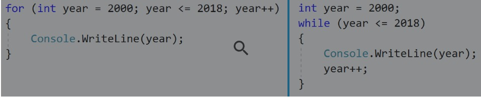

Section 5 : Contrôle de flux : for et while
===

## Information
- Title:  `Contrôle de flux : for et while`
- Authors:  `Etienne KOA`


## Quizz

**Question 1 :**
Quelles sont les 3 parties d’une boucle for ?

*Initialiseur, Condition et Itérateur*

**Question 2 :**
Vous essayez de trouver un bug dans votre code en parcourant le code dans le débogueur.

Vous entrez dans une boucle for qui ressemble à

```
for (int i = 0; i < 10000; i++)
```

Est-ce que tu ...

*Définir un point d'arrêt sur l'instruction après la boucle, puis utiliser `Continue` piur exécuter la boucle à pleine vitesse? Une fois que vous avez atteint le nouveau point d'arrêt, vous pouvez examiner vos variables pour vous assurer que la boucle a fait ce que vous attendiez.*

*Vous connaissez évidemment l’importance de `travailler plus intelligemment, pas plus dur`.*

**Question 3 :**
Lequel de ces blocs de code n’imprimera `pas` tous les nombres de 0 à 100 ?

```
    for (int i = 0; i < 100; i++)
    {
      Console.WriteLine(i);
    }
```

*La condition de cette boucle terminera la boucle lorsque `i` vaut 100. La dernière valeur imprimée sera 99.*

**Question 4 :**
Quelle est la principale différence entre une `boucle while` et une `boucle do-while` ?

*Etant donné que la condition est testée au début d'une boucle `while`, mais à la fin d'une boucle `do while`, le code d'une boucle `while` peut être exécuté zéro ou plusieurs fois, alors que le code d'une boucle `do while` sera toujours exécuté. Exécuté au moins une fois.*

**Question 5 :**
Examinez attentivement ces deux blocs de code - une boucle for et une boucle while :



Ils initialisent tous deux l'année à 2000 ; ils testent tous les deux la condition année <= 2018 à chaque tour de boucle ; et ils incrémentent tous les deux d'année avant de refaire une boucle.

Ils font tous les deux la même chose, alors y a-t-il vraiment une différence entre une boucle for et une boucle while ?

*Il ya une légère différence; la variable `year` sera disponible après la fin de la boucle `while`, mais, ne sera pas disponible en dehors de la boucle `for`*

*Correct. Dans la boucle for, la variable `year` n'existe qu'à l'intérieur de la boucle. Dans l'exemple de la boucle while, `year` est déclarée en dehors de la boucle et sera disponible une fois la boucle terminée.*


